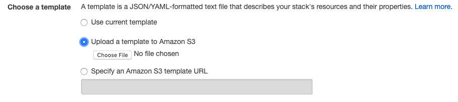

# AWS LabX CloudFormation Stack

This Deployment implements a high availability solution for identity and isolation in multi-tenant software as a service (SaaS) environments, using Amazon Cognito as the identity provider.

The Deployment sets up the AWS environment for identity and isolation spanning the roles in a multi-tenant environment. The Deployment deployment includes AWS services such as Amazon Cognito, AWS Lambda, Amazon API Gateway, and Amazon EC2 Container Service (Amazon ECS).

This Deployment deploys the SaaS architecture into a virtual private cloud (VPC) that spans two Availability Zones in your AWS account. The deployment and configuration tasks are automated by AWS CloudFormation templates that you can customize during launch.

# Setup

- Copy the contents of the Git repository to a bucket of the format: **QSS3BucketName/QSS3KeyPrefix**
    
    **EG: dev-deployment/stacks**

- In the AWS Console, use the second radio option for creating a Stack

    

- Select the file **ref-arch-start.yml**. This will be in your local copy of the repo.
- Click Next
- All fields are required on the second page. Don't change the values for the DynamoDB tables.
- Click Next
- On the third page leave defaults and click Next
- On the fourth page, check the Acknowledgement buttons at the bottom of the page and click Create.
- The install may take up to 2 hours to run.

The Deployment deploys into a new virtual private cloud (VPC) on AWS.

### Full Documentation can be found in repo at /docs/ReferenceArchitectureAnalysis.docx

#### Original Reference Architecture on which this is based:

For architectural details, best practices, step-by-step instructions, and customization options, see the [deployment guide](https://fwd.aws/XKYDP).

